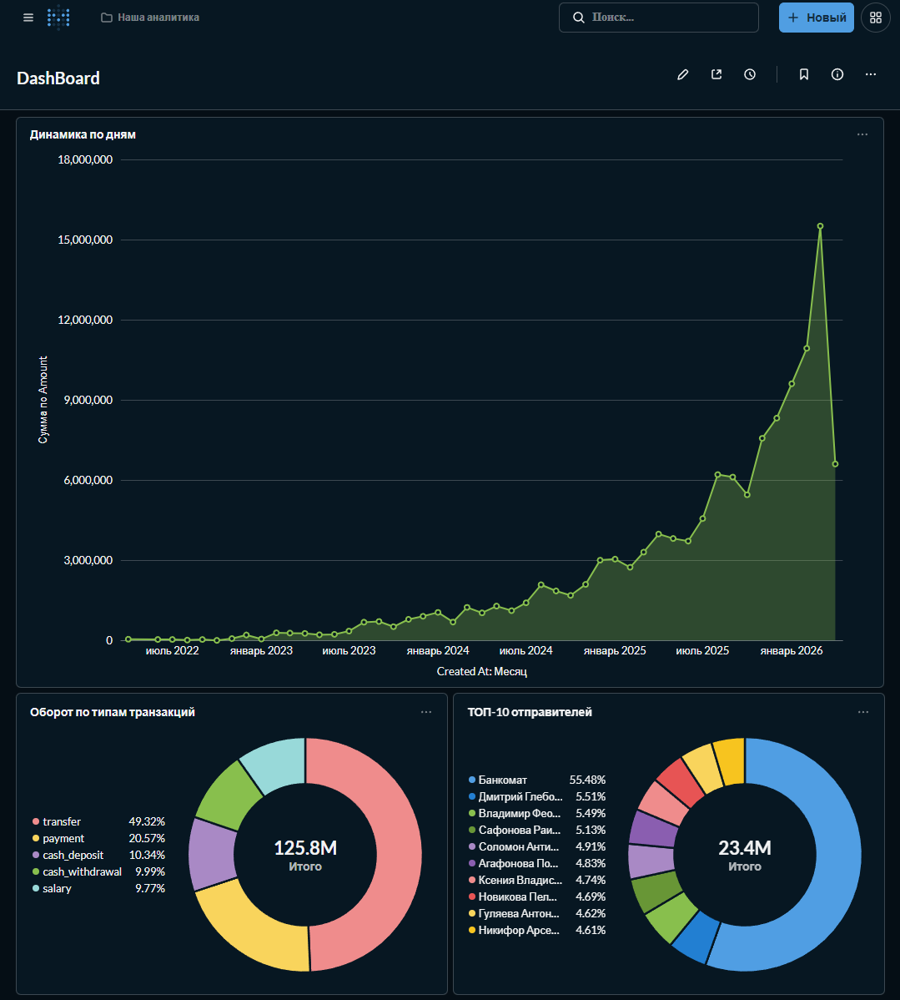

# 🏦 E-Bank DWH & ETL Pipeline (Dockerized)

Это мой проект, в котором я с нуля спроектировал и построил аналитическое хранилище данных (DWH) для небольшого цифрового банка. 

Проект прошел путь от простых SQL-скриптов до **полностью докеризированной инфраструктуры**, которая разворачивается одной командой.

## 📊 Результат работы (BI Dashboard в Metabase)


## 🛠 Что внутри? (Стек)
* **Инфраструктура:** Docker, Docker Compose
* **Базы данных:** PostgreSQL (OLTP & OLAP слои)
* **ETL / Инженерия:** Python (psycopg2, pandas, faker), SQL
* **BI / Аналитика:** Metabase
* **Big Data:** PySpark (Google Colab)

## 📁 Как всё устроено (Архитектура)


В репозитории используется доменное разделение логики:

* `docker-compose.yml` - Оркестрация. Поднимает БД, Metabase и среду для скриптов.
* `/etl` — Сервис загрузки и трансформации данных.
  * `data_generator.py` - Инициализирует DDL-схемы и генерирует реалистичные данные (клиенты, счета, транзакции).
  * `etl_pipeline.py` - Переносит данные из сырого слоя в аналитические витрины (конвертация валют, агрегации).
  * `etl_pyspark_colab_example` - Полигон для PySpark (пример обработки тех же данных в парадигме Big Data).
* `/migrations` - Скрипты уровня базы данных (например, умный триггер для авто-обновления баланса счетов).
* `/analytics` - Библиотека сложных SQL-запросов (CTE, Window Functions, Views) для поиска аномалий и топов.
* `oop_bank` - Простейшая ООП модель банка (класс BankClient с методами пополнения и снятия)

## 🚀 Как запустить у себя (Запуск в одну кнопку)

Вам больше не нужно устанавливать PostgreSQL или Python на свой компьютер. Нужен только **Docker**.

**1. Клонируйте репозиторий:**
```bash
git clone https://github.com/fiesttta/e_bank_dwh.git
cd e_bank_dwh
```

**2. Поднимите инфраструктуру (БД и BI-систему):**
```bash
docker compose up -d
```

**3. Сгенерируйте данные (создание таблиц + 5000 транзакций):**
```bash
docker compose run --rm scripts python data_generator.py
```

**4. Запустите ETL-процесс (создание витрин):**
```bash
docker compose run --rm scripts python etl_pipeline.py
```

🎉 **Готово! Инфраструктура развернута.**

Теперь вы можете подключиться к визуальным интерфейсам для работы с данными.

### 📊 1. BI-система (Metabase)
* **URL:** [http://localhost:3000](http://localhost:3000)
* **Как подключить базу:**
  * Выберите тип: **PostgreSQL**
  * **Host:** `db` *(обращение идет по имени контейнера)*
  * **Database name:** `e_bank`
  * **Username:** `postgres`
  * **Password:** `fiestta`

### 🛠 2. Управление базой (pgAdmin 4)
* **URL:** [http://localhost:5050](http://localhost:5050)
* **Вход в интерфейс:** `admin@admin.com` / `admin`
* **Как подключить базу (Add New Server):**
  * Вкладка **General** -> Name: `E-Bank DB`
  * Вкладка **Connection**:
    * **Host name/address:** `db`
    * **Port:** `5432`
    * **Maintenance database:** `e_bank`
    * **Username:** `postgres`
    * **Password:** `fiestta`