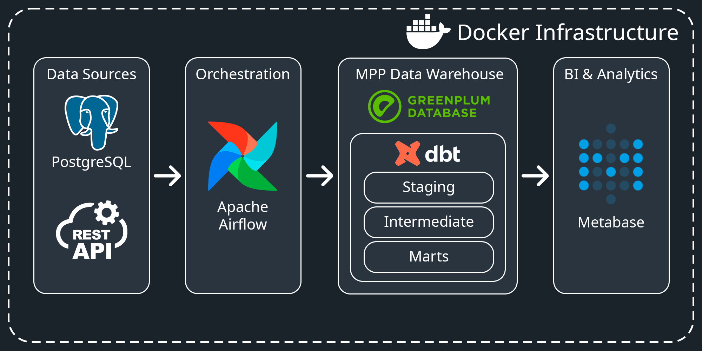

# 🏦 E-Bank DWH: End-to-End Analytical Platform

Масштабируемое хранилище данных (DWH) для цифрового банка. Проект прошел большой путь эволюции: от ручной генерации данных и простых SQL-запросов до полноценного докеризированного ELT-конвейера с MPP-архитектурой и автоматическими проверками качества.

## 🎯 Зачем нужен этот проект? (Бизнес-задача)
В любом банке данные о транзакциях, счетах и курсах валют хранятся в разных системах. Задача этого проекта — построить платформу, которая ежедневно:
1. Автоматически забирает сырые данные из транзакционной базы.
2. Очищает их и проверяет на ошибки (Data Quality).
3. Приводит все мультивалютные переводы к единому знаменателю (в рубли) по историческому курсу.
4. Отдает аналитикам готовые витрины данных для построения дашбордов в BI-системе.

## ⚙️ Архитектурная схема конвейера


## 📊 BI Dashboard (Metabase)


## 🛠 Технологический стек и архитектурные решения

* **Хранилище данных: Greenplum (DWH)**
  * Использование колоночного хранения (`orientation=column`), компрессии (`zstd`) и MPP-архитектуры для аналитических нагрузок. Настроено партиционирование транзакций по дате и дистрибуция (`DISTRIBUTED BY`) для избежания Data Skew.
* **Источники: PostgreSQL (OLTP) & REST API**
  * Эмуляция системы банка и интеграция с внешним API для загрузки курсов валют.
* **Трансформация (ELT): dbt (Data Build Tool)**
  * Отказ от In-Memory вычислений в Python в пользу мощностей Greenplum. Реализована слоистая архитектура (Staging -> Intermediate -> Marts).
* **Оркестрация: Apache Airflow**
  * Использование `FileSensor` для запуска по событию, ветвление (`BranchPythonOperator`) и батч-оптимизация трансфера данных (`COPY TO/FROM`).
* **BI и UI Инструменты:**
  * **Metabase** — построение финальных дашбордов для бизнеса.
  * **CloudBeaver** — IDE для администрирования Greenplum.
  * **pgAdmin 4** — управление транзакционной БД PostgreSQL.
* **Инфраструктура: Docker & Docker Compose**
  * Полностью изолированная среда (IaC). Включает основные сервисы и служебные контейнеры (`airflow_db` для метаданных оркестратора, `greenplum_init` для автоматической накатки DDL миграций).

## 📁 Структура репозитория

* `/analytics` — Библиотека SQL-запросов (анализ топ-отправителей, оконные функции, поиск "спящих" клиентов).
* `/dags` — DAG-файлы Airflow:
  * `bank_pipeline_dag.py` — Основной ELT-пайплайн.
  * `clean_xcom_dag.py` — DAG для очистки служебной кэш-памяти оркестратора.
* `/etl` — Модули извлечения и загрузки (EL):
  * `data_generator.py` — Синтез данных банка (~200 000 транзакций, 3000 клиентов).
  * `pg_to_gp_transfer.py` — Мощный скрипт потокового переноса данных из OLTP в MPP.
  * `dq_checks.py` — Data Quality проверки перед сборкой витрин.
  * `fetch_rates.py` — REST API интеграция.
  * `etl_pyspark_colab_example.py` — Полигон для распределенных вычислений на PySpark.
* `/dbt_project` — SQL-модели трансформации данных и сборки витрин.
* `/migrations` — DDL скрипты инициализации Greenplum (`init_greenplum.sql`) и триггеры.
* `start.sh` — Bash-скрипт для умного развертывания инфраструктуры.
* `docker-compose.yml`, `*.json` — Конфиги контейнеров и преднастройки доступов.

## 🚀 Быстрый старт (Local Environment)

**Требования:** `Docker`, `Docker Compose`, ОС Linux (тестировалось на Fedora) или macOS. Windows поддерживается через WSL2.

**1. Клонирование репозитория:**
```bash
git clone [https://github.com/fiesttta/e_bank_dwh.git](https://github.com/fiesttta/e_bank_dwh.git)
cd e_bank_dwh

```

**2. Развертывание инфраструктуры:**
Скрипт автоматически создаст необходимые директории, выдаст права (`chmod`) и поднимет контейнеры.

```bash
chmod +x start.sh
./start.sh

```

**3. Запуск пайплайна:**
Инфраструктура разворачивается вместе с триггер-файлом. Airflow автоматически выйдет из паузы, обнаружит файл и запустит ELT-процесс генерации, переноса и трансформации данных.

## 🌐 Интерфейсы и доступы

* **Apache Airflow:** [http://localhost:8080](http://localhost:8080) (`fiestta` / `fiestta`)
* **Metabase (BI):** [http://localhost:3000](http://localhost:3000)
* **CloudBeaver (Greenplum UI):** [http://localhost:8090](http://localhost:8090) (Подключение преднастроено через `cloudbeaver-data-sources.json`)
* **pgAdmin 4 (Postgres UI):** [http://localhost:5050](http://localhost:5050) (`admin@admin.com` / `admin`) (Подключение преднастроено через `pgadmin-servers.json`)

---

**Автор:**
* Лукьянов Никита Романович 

**Связь:** 
* Telegram: @fiesttttta
* VK: @fiesttta
* E-mail: fiestttttta@gmail.com