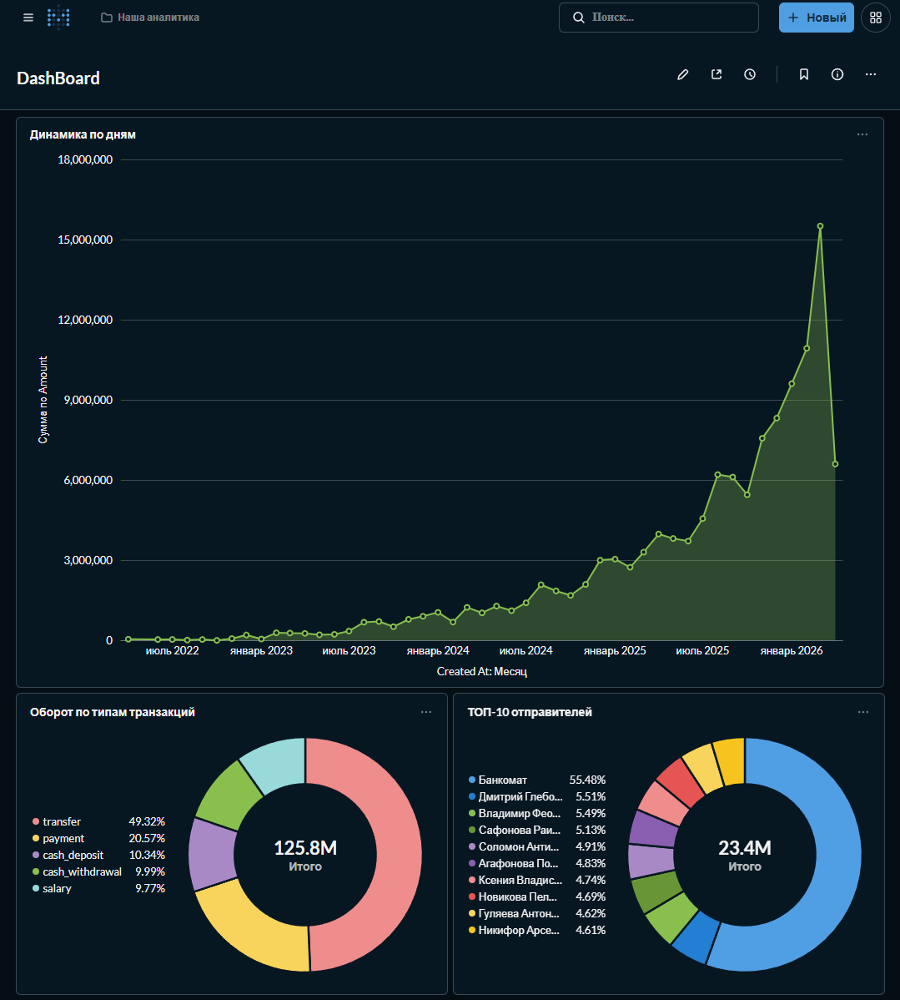

# 🏦 E-Bank DWH & ETL Pipeline (Dockerized)

Это мой комплексный проект, в котором я с нуля спроектировал и построил аналитическое хранилище данных (DWH) для цифрового банка. 

Проект прошел путь от простых SQL-запросов до **умного докеризированного пайплайна**, который управляется оркестратором, общается со сторонними API, использует ветвление логики (Branching) и ждущие сенсоры (Sensors).

## 📊 Результат работы (BI Dashboard в Metabase)


## 🛠 Что внутри? (Стек)
* **Инфраструктура:** Docker, Docker Compose, Bash-скрипт автоматизации (`start.sh`).
* **Оркестрация (Apache Airflow):**
  * `PostgresHook` (безопасное подключение к БД).
  * `Variable` (хранение секретов и URL).
  * `XCom` (обмен метаданными между тасками).
  * `BranchPythonOperator` (умное ветвление логики).
  * `FileSensor` (ожидание файлов от внешних систем).
* **Базы данных:** PostgreSQL (OLTP & OLAP слои, проектирование схемы).
* **ETL / Инженерия:** Python (`requests`, `psycopg2`, `pandas`, `faker`), SQL.
* **Аналитика:** Metabase (BI), оконные функции (Window Functions), CTE.
* **Data Quality:** Поиск аномалий и через XCom ветвление DAG по "зеленой" или "красной" ветке.
* **Big Data:** PySpark (Google Colab)

## 📁 Как всё устроено (Архитектура)

* `/analytics` - Библиотека сложных SQL-запросов (CTE, Window Functions, Views) для поиска аномалий и топов.
* `/dags` — Настройки оркестратора (DAGs):
  * `bank_pipeline_dag.py` — Главный конвейер. Ожидает триггер-файл -> Генерирует данные -> Парсит API -> Строит витрины -> Запускает DQ-ветвление.
  * `clean_xcom_dag.py` — Служебный DAG для ежедневной очистки кэша базы Airflow (удаляет устаревшие XCom).
* `/etl` — Python-модули (ETL):
  * `data_generator.py` — Имитация 5-летней истории банка (создание клиентов, счетов и транзакций с соблюдением хронологии).
  * `fetch_rates.py` — Интеграция с REST API (exchangerate-api) для получения свежих курсов валют.
  * `etl_pipeline.py` — Трансформация сырых данных в аналитическую витрину `dm_transactions_rub`.
  * `dq_checks.py` — Data Quality тесты. Ищет аномалии и через XCom направляет DAG по "зеленой" или "красной" ветке.
  * `etl_pyspark_colab_example.py` - Полигон для PySpark (пример обработки тех же данных в парадигме Big Data).
* `/migrations` - Скрипты уровня базы данных (например, умный триггер для авто-обновления баланса счетов).
* `start.sh` — Умный скрипт для безопасной настройки UID/прав в Linux и запуска Docker.
* `docker-compose.yml` - Поднимает БД, Airflow, Metabase и среду для скриптов.

## 🚀 Как запустить проект (Боевая среда)

**1. Клонируйте репозиторий:**
```bash
git clone https://github.com/fiesttta/e_bank_dwh.git
cd e_bank_dwh
```

**2. Разверните инфраструктуру (Docker):**
Скрипт сам создаст папки, настроит права доступа и поднимет контейнеры.
```bash
chmod +x start.sh
./start.sh
```

**3. Запустите умный конвейер (Airflow):**
* Перейдите в интерфейс Airflow (ссылка ниже) и включите DAG `e_bank_daily_etl`.
* Нажмите **Play (Trigger DAG)**.
* ⚠️ **Внимание:** DAG использует `FileSensor`. Он остановится на первой задаче и будет ждать внешний сигнал.
* Чтобы дать сигнал и запустить обработку, откройте терминал и создайте пустой файл в папке `etl`:
  ```bash
  touch etl/trigger.txt
  ```
* Airflow увидит файл, радостно побежит качать курсы валют, считать витрины и проверять качество данных!

🎉 **Готово! Инфраструктура развернута и данные готовы к анализу**

## 💻 Настройка для разработчиков (Локально)
Чтобы работать с кодом в VS Code (с работающим автодополнением и без красных подчеркиваний), настройте виртуальное окружение:
```bash
python3 -m venv venv
source venv/bin/activate
pip install -r requirements-dev.txt
```
*(Файл `.vscode/settings.json` уже включен в репозиторий, пути импортов подтянутся автоматически).*

## 🌐 Доступы к интерфейсам (Где смотреть результат)

### ⚙️ 1. Оркестратор (Apache Airflow)
* **URL:** [http://localhost:8080](http://localhost:8080)
* **Логин/Пароль:** `fiestta` / `fiestta`

### 📊 2. BI-система (Metabase)
* **URL:** [http://localhost:3000](http://localhost:3000)
* **Как подключить базу:**
  * Как к вам обращаться: **Пишем что угодно**
  * Для чего вы будете использовать Metabase?: **Тоже что угодно**
  * Добавьте свои данные:
    * Выберите тип: **PostgreSQL**
    * Connection string: `postgresql://fiestta:fiestta@db:5432/e_bank`

### 🛠 3. Управление базой (pgAdmin 4)
* **URL:** [http://localhost:5050](http://localhost:5050)
* **Вход в интерфейс:** `admin@admin.com` / `admin`
* **Как подключить базу (Add New Server):**
  * Вкладка **General** -> Name: `E-Bank DB`
  * Вкладка **Connection**:
    * **Host name/address:** `db`
    * **Port:** `5432`
    * **Maintenance database:** `e_bank`
    * **Username:** `fiestta`
    * **Password:** `fiestta`